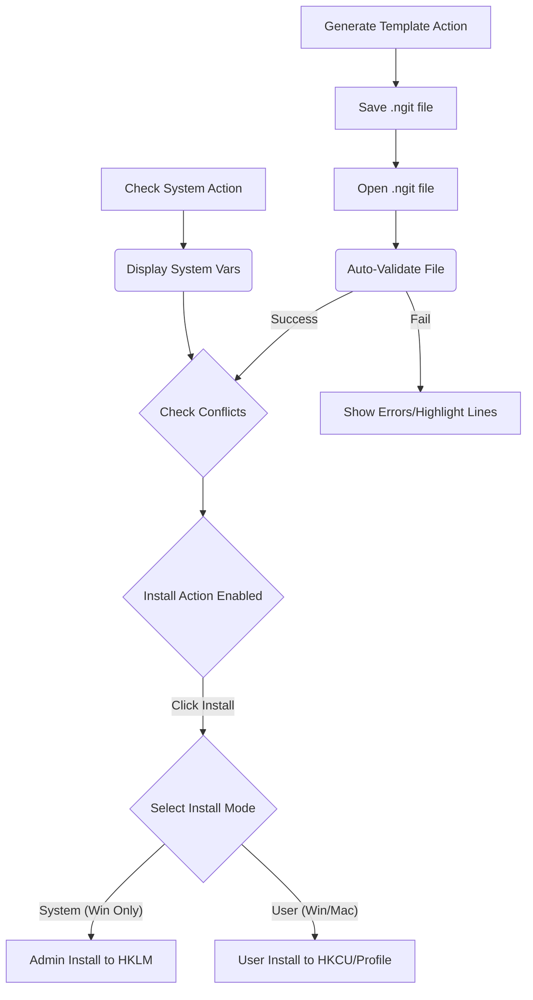

# License Manager v2.0


*Improved license configuration management for Windows and macOS, featuring enhanced validation and clear feedback.*

## Table of Contents

*   [Features](#features)
*   [Installation](#installation)
*   [Usage](#usage)
    *   [Interface Overview](#interface-overview)
    *   [Workflow](#workflow)
*   [File Specification (`.ngit`)](#file-specification-ngit)
    *   [Format Example](#format-example)
    *   [Validation Rules](#validation-rules)
*   [Platform Behavior](#platform-behavior)
*   [Troubleshooting](#troubleshooting)
*   [License](#license)
*   [Documentation Information](#documentation-information)

## Features

✅ **Enhanced UI & UX**
*   **Toolbar Interface:** All primary actions (Open, Generate, Validate, Check System, Install, Logs) available via a clear toolbar with icons.
*   **Line Numbers:** Editor panel now includes line numbers for easy error identification.
*   **Real-time Feedback:**
    *   **Status Bar:** Displays current file status (modified, validated, failed), conflicts, and general readiness.
    *   **Error Highlighting:** Lines with validation errors are visually marked in the editor (red underline).
    *   **Conflict Indicator:** A warning icon (⚠️) appears near the 'Install' action if conflicts are detected after validation.
*   **Improved Logging:** Color-coded messages with timestamps and status icons (✅, ℹ️, ⚠️, ❌) for different levels (Success, Info, Warning, Error, System, Detail). Collapsible and clearable log panel.
*   **Clearer Validation:** Separate actions for "Validate File" (checks current editor content) and "Check System" (reads current environment variables).
*   **Install Safety:** "Install" action is disabled until the loaded file is successfully validated.
*   **Unsaved Changes Warning:** Prompts the user if attempting to close or open a new file with unsaved modifications.

✅ **Core Functionality**
*   **Dual Installation Modes:**
    *   💻 **Windows:** System-wide (HKLM, requires Admin) or User-specific (HKCU).
    *   🍎 **macOS:** User-specific (`~/.zprofile` or `~/.bash_profile`).
*   **Auto-Validation:** File content is automatically validated upon loading.
*   🛡️ **Conflict Detection:** Compares validated file licenses against current system environment variables.
*   🎨 Syntax highlighting for `.ngit` files (comments, keys, values, equals sign).
*   📋 One-click template generation (`.ngit`).
*   **Cross-Platform:** Primarily targets Windows and macOS for installation. Validation/editing works on other platforms.

## Installation

### Requirements
*   Python 3.8+
*   PyQt5
*   Platform Dependencies:
    *   **Windows**: `winreg` module (standard library), Administrator privileges for system-wide installs.
    *   **macOS**: Write permissions to user's profile files (`~/.zprofile` or `~/.bash_profile`).

```bash
# Install core dependency
pip install pyqt5
```
*(Note: `pyyaml` and `psutil` might be needed by the main application but are not directly used by this specific module).*

## Usage

### Interface Overview

1.  **Toolbar:** Contains all main actions grouped logically:
    *   **File:** `📂 Open`, `📄 Generate Template`
    *   **Validation:** `🔍 Validate File`, `⚙️ Check System`
    *   **Installation:** `⚡ Install`, `☐ System-Wide (Admin)` checkbox (Windows only), `⚠️ Conflict Indicator` (appears when needed)
    *   **Log:** `📊 Toggle Logs`, `🗑️ Clear Log`
2.  **Editor Panel (`CodeEditor`):**
    *   Displays `.ngit` file content with line numbers.
    *   Real-time syntax highlighting.
    *   Lines with validation errors are underlined in red.
3.  **Log Panel (`QTextEdit`):**
    *   Collapsible section at the bottom.
    *   Displays timestamped messages with status icons and colors.
    *   Can be cleared using the toolbar action.
4.  **Status Bar:**
    *   Located at the bottom of the window.
    *   Shows current file name, modification status (`*`), validation result, and conflict status.

### Workflow


1.  **Open** or **Generate** an `.ngit` file.
2.  File content is **automatically validated** upon load. Errors are shown in the log and highlighted in the editor.
3.  Optionally, use **Check System** to view current environment licenses.
4.  If validation passes, **conflicts** (if any) between file and system are logged, and the `⚠️` indicator may appear.
5.  The **Install** action is enabled only if validation passed.
6.  Select **System-Wide** (if available/desired) and click **Install**.
7.  Confirm overwrites if conflicts were detected.
8.  Installation proceeds based on OS and selected mode.

## File Specification (`.ngit`)

### Format Example

```ini
# NGIT License Configuration File v1.5
# Lines starting with # are comments.

CMG_LIC_HOST = 2700@license-server.example.com
SLBSLS_LICENSE_FILE = C:\Path\To\license.lic
# LM_LICENSE_FILE = 27025@flex-server.company.com
# SCPLMD_LICENSE_FILE = D:\Licenses\scplmd_v2.lic
tNavigator_LICENSE_SERVER = https://tnav-license.rfdyn.eu:8056/
```

### Validation Rules

1.  **Structure:** Key-value pairs separated by `=`, one per line. Lines starting with `#` are ignored.
2.  **Mandatory Keys** (at least one required and valid):
    ```
    CMG_LIC_HOST, SLBSLS_LICENSE_FILE, LM_LICENSE_FILE,
    SCPLMD_LICENSE_FILE, tNavigator_LICENSE_SERVER
    ```
3.  **Format Requirements** (Defined by Regex in code):
    *   Keys must be valid identifiers (uppercase letters, numbers, underscore).
    *   Values must match specific patterns (e.g., `Port@Host`, valid file path, URL). See `MANDATORY_LICENSES` dictionary in code for details.
    *   No duplicate keys allowed.

## Platform Behavior

| Feature              | Windows                             | macOS                               |
| :------------------- | :---------------------------------- | :---------------------------------- |
| **System Install**   | HKLM Registry                       | *Not Implemented*                   |
| **User Install**     | HKCU Registry                       | `~/.zprofile` or `~/.bash_profile`  |
| **Privilege Req.**   | **Admin** for System, User for User | User for User                       |
| **Change Propagation** | System broadcast message            | Requires new terminal or `source` |
| **Supported?**       | ✅ System & User                    | ✅ User Only                         |

*(Linux installation support has been removed).*

## Troubleshooting

1.  **"Write access denied" / "Permission denied" errors:**
    *   Ensure you run the application as Administrator for **System-Wide** installs on Windows.
    *   Check file permissions for profile files (`.zprofile`, `.bash_profile`) on macOS.
    *   Antivirus or security software might interfere with registry/file writes.
2.  **Changes not appearing (macOS/Registry without Broadcast):**
    *   Open a **new** terminal window after installation.
    *   Run `source ~/.zprofile` or `source ~/.bash_profile` in an existing terminal (macOS).
    *   Log out and back in, or restart the system.
3.  **Validation failures:**
    *   Check the line number indicated in the log message (`[❌ ERROR] Line X: ...`).
    *   Look for red underlines in the editor on the corresponding line.
    *   Ensure the format matches the examples or required regex pattern (see code). Check for typos, missing `=`, duplicate keys.
4.  **Install button disabled:**
    *   The file must be loaded *and* pass validation successfully (no errors reported in the log or highlighted in the editor). Click "Validate File" if unsure.
5.  **Conflict indicator (⚠️) showing:**
    *   This means the validated file contains license keys that are *also* present in your system environment but with *different* values. Review the log warnings carefully before deciding to install/overwrite.

### Sample Log Output

```
[10:15:01 INFO] ℹ️ INFO: File loaded: prod_licenses.ngit
[10:15:01 INFO] ℹ️ INFO: Starting validation for prod_licenses.ngit...
[10:15:01 ERROR] ❌ ERROR: Line 3: Invalid value format for SLBSLS_LICENSE_FILE
[10:15:01 ERROR] ❌ ERROR: Line 5: Duplicate key 'CMG_LIC_HOST' found
[10:15:01 WARN] ⚠️ WARN: License conflicts DETECTED:
[10:15:01 DETAIL] ➡️ DETAIL:   LM_LICENSE_FILE: System='27000@old' vs File='27025@new'
```

## License

Proprietary - © 2024 Taras
*(Ensure this matches your intended license)*

## Documentation Information

**Version**: 2.0
**Last Updated**: March 25, 2024 *(Adjust date as needed)*
```