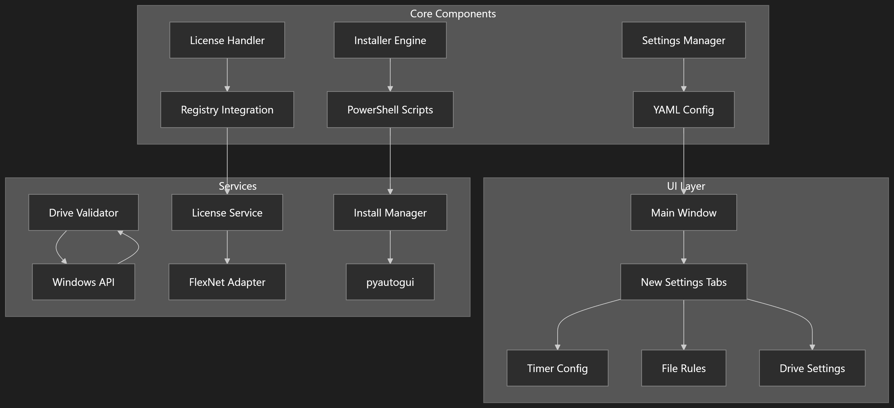

# Програмний комплекс "Організатор робочого столу"

 <!-- Додайте сюди посилання на діаграму архітектури, якщо вона є -->

**Високоінтегроване програмне рішення, розроблене для оптимізації та автоматизації процесів керування робочим середовищем користувача. Комплекс надає інструменти для систематизації файлів, централізованого моніторингу ліцензій ПЗ та спрощеного розгортання додатків.**

---

## Зміст

- [Вступ](#вступ)
- [Ключові можливості](#ключові-можливості)
- [Технологічний стек](#технологічний-стек)
- [Вимоги та встановлення](#вимоги-та-встановлення)
  - [Системні вимоги](#системні-вимоги)
  - [Необхідні бібліотеки](#необхідні-бібліотеки)
  - [Процес встановлення](#процес-встановлення)
- [Експлуатація та використання](#експлуатація-та-використання)
  - [Запуск основного модуля](#запуск-основного-модуля)
  - [Використання додаткових модулів](#використання-додаткових-модулів)
- [Конфігурація системи](#конфігурація-системи)
- [Внесок у розробку (Contributing)](#внесок-у-розробку-contributing)
- [Ліцензування](#ліцензування)
- [Журнал змін (Changelog)](#журнал-змін-changelog)
- [Технічна підтримка та вирішення проблем](#технічна-підтримка-та-вирішення-проблем)

---

## Вступ

Програмний комплекс "Організатор робочого столу" створений для вирішення поширених проблем, пов'язаних із хаосом файлів на робочому столі, складністю відстеження ліцензій та рутинними процесами інсталяції програмного забезпечення. Це рішення об'єднує три функціональні блоки в єдину систему:

1.  **Основний модуль "Організатор робочого столу":**
    *   **Призначення:** Автоматизація процесу організації файлів у визначених користувачем локаціях (наприклад, робочий стіл).
    *   **Функціонал:** Дозволяє налаштовувати правила сортування, періодичність очищення (за таймером), вибирати цільові директорії для переміщення файлів та зберігати конфігурації користувача.
    *   **Детальніше:** [Документація основного модуля (v4.2)](Main_update_v4.2.md)

2.  **Модуль керування ліцензіями:**
    *   **Призначення:** Надання інструментів для централізованого обліку та валідації ліцензій програмного забезпечення.
    *   **Функціонал:** Здійснює перевірку конфігурацій ліцензій, допомагає виявляти потенційні конфлікти або невідповідності.
    *   **Детальніше:** [Документація модуля ліцензій (Update 2)](License_Manager_Update_2.md)

3.  **Модуль інсталяції програм:**
    *   **Призначення:** Спрощення та автоматизація процесу встановлення програм.
    *   **Функціонал:** Включає можливості сканування директорій на наявність інсталяційних пакетів, підтримку параметрів для тихої (автоматичної) інсталяції та базове відстеження змін у системі (наприклад, у реєстрі Windows, якщо підтримується інсталятором).
    *   **Детальніше:** [Документація модуля інсталяції](program_install_readme.md)

## Ключові можливості

*   **Автоматизована організація файлів:** Налаштування правил сортування та автоматичне очищення за розкладом.
*   **Гнучке налаштування:** Вибір дисків, директорій, параметрів таймера. Збереження та завантаження профілів налаштувань.
*   **Централізоване керування ліцензіями:** Інструменти для валідації та моніторингу стану ліцензій.
*   **Автоматизація інсталяції ПЗ:** Підтримка тихої інсталяції для сумісних інсталяторів.
*   **Модульна архітектура:** Можливість використання тільки необхідних компонентів.
*   **Графічний інтерфейс користувача:** Інтуїтивно зрозумілий інтерфейс, побудований на PyQt5.

## Технологічний стек

*   **Мова програмування:** Python 3.8+
*   **Графічний інтерфейс:** PyQt5
*   **Робота з конфігураціями:** PyYAML
*   **Системна інформація:** psutil
*   **Взаємодія з ОС Windows:** pywin32 (для специфічних функцій Windows, наприклад, роботи з реєстром)

## Вимоги та встановлення

### Системні вимоги

*   **Операційна система:**
    *   Windows (рекомендовано, повна функціональність завдяки `pywin32`)
*   **Python:** Версія 3.8 або новіша.

### Необхідні бібліотеки

Перелічені бібліотеки є обов'язковими для роботи комплексу:

*   `PyQt5`: Для графічного інтерфейсу.
*   `PyYAML`: Для роботи з файлами конфігурації (`.yaml`).
*   `psutil`: Для отримання системної інформації (наприклад, списку дисків).
*   `pywin32`: *Тільки для Windows*. Необхідна для специфічних функцій ОС, таких як взаємодія з реєстром у модулі інсталяції.

### Процес встановлення

1.  **Клонування репозиторію:**
    ```bash
    git clone <URL_вашого_репозиторію>
    cd <назва_директорії_проекту>
    ```
    Або завантажте архів проекту та розпакуйте його.

2.  **Встановлення залежностей:**
    Рекомендується створити та активувати віртуальне середовище:
    ```bash
    python -m venv venv
    # Windows
    .\venv\Scripts\activate
    # Linux/macOS
    source venv/bin/activate
    ```
    Встановіть залежності (переконайтесь, що у вас є файл `requirements.txt`, або встановіть вручну):
    ```bash
    # Рекомендований спосіб (якщо є requirements.txt)
    pip install -r requirements.txt

    # Або встановлення вручну:
    pip install pyqt5 pyyaml psutil
    # Тільки для Windows:
    pip install pywin32
    ```
    *Примітка:* Якщо файл `requirements.txt` відсутній, створіть його з переліком бібліотек вище.

3.  **Розміщення опціональних модулів:**
    Щоб активувати функціонал керування ліцензіями та інсталяції програм, скопіюйте файли `license_manager.py` та `program_install.py` у піддиректорію `modules`, розташовану в кореневій папці проекту. Якщо директорія `modules` відсутня, створіть її.

## Експлуатація та використання

### Запуск основного модуля

Для запуску головного вікна програми та доступу до функціоналу організації робочого столу виконайте команду в терміналі з кореневої директорії проекту:
```bash
python v4.2.py
```
Це відкриє графічний інтерфейс, де можна налаштувати параметри автоматичного очищення, запустити процес вручну або активувати таймер. Детальний опис інтерфейсу та можливостей дивіться у [посібнику користувача основного модуля](Main_update_v4.2.md#usage).

### Використання додаткових модулів

Якщо файли `license_manager.py` та `program_install.py` були коректно розміщені у директорії `modules`:

*   **Модуль керування ліцензіями:** Доступний через пункт меню "Ліцензія" в головному вікні програми. Дозволяє додавати, перевіряти та керувати конфігураціями ліцензій. [Детальніше](License_Manager_Update_2.md#usage).
*   **Модуль інсталяції програм:** Доступний через пункт меню "Інсталяція програм". Надає інтерфейс для вибору інсталяторів та запуску процесу встановлення (включаючи опцію тихої інсталяції). [Детальніше](program_install_readme.md#usage).

## Конфігурація системи

Основні параметри роботи програмного комплексу зберігаються у файлі `config.yaml` в кореневій директорії. Цей файл дозволяє налаштувати:

*   Шляхи за замовчуванням для сортування файлів.
*   Параметри таймера автоматичного очищення.
*   Інші налаштування основного модуля.

Додаткові модулі можуть використовувати власні конфігураційні файли або зберігати налаштування іншим чином, як описано в їх документації.

Для отримання детальної інформації про доступні параметри конфігурації зверніться до розділу [Налаштування та конфігурація](Main_update_v4.2.md#settings-configuration) документації основного модуля.

## Внесок у розробку (Contributing)

Ми вітаємо внесок спільноти у розвиток проекту! Якщо ви бажаєте долучитися до розробки, будь ласка, дотримуйтесь стандартного процесу:

1.  **Форкніть репозиторій** на GitHub/GitLab.
2.  **Створіть нову гілку** для вашої функціональності або виправлення (`git checkout -b feature/my-new-feature` або `git checkout -b fix/bug-fix`).
3.  **Зробіть необхідні зміни** у коді та задокументуйте їх.
4.  **Закомітьте зміни** (`git commit -am 'Add some feature'`).
5.  **Надішліть зміни** до вашого форку (`git push origin feature/my-new-feature`).
6.  **Створіть Pull Request** до основного репозиторію проекту.

Будь ласка, ознайомтесь з детальними рекомендаціями та правилами для контрибуторів у файлі [CONTRIBUTING.md](CONTRIBUTING.md) (якщо він існує, створіть його за потреби).

## Ліцензування

Дане програмне забезпечення є власністю розробника та розповсюджується на умовах, визначених у ліцензійному файлі.

**Copyright © 2024, Тарас**

Повна інформація про умови використання та розповсюдження міститься у файлі [LICENSE.md](LICENSE.md).

## Журнал змін (Changelog)

Детальна історія змін, внесених у кожну версію програмного комплексу, доступна у таких джерелах:

*   Загальний огляд основних змін: [CHANGELOG.md](CHANGELOG.md)
*   Деталі оновлень для конкретних версій та модулів:
    *   [Основний модуль v4.2](Main_update_v4.2.md#documentation-information)
    *   [Модуль керування ліцензіями Update 2](License_Manager_Update_2.md#documentation-information)

Рекомендуємо ознайомлюватися з журналом змін при оновленні версії.

## Технічна підтримка та вирішення проблем

Якщо у вас виникли труднощі під час встановлення, налаштування чи використання програми:

1.  **Зверніться до документації:** Перегляньте відповідні розділи документації для кожного модуля, особливо розділи "Troubleshooting" (Вирішення проблем) або "Limitations" (Обмеження):
    *   [Основний модуль: Troubleshooting](Main_update_v4.2.md#troubleshooting)
    *   [Менеджер ліцензій: Troubleshooting](License_Manager_Update_2.md#troubleshooting)
    *   [Інсталятор програм: Limitations & Considerations](program_install_readme.md#limitations--considerations)
2.  **Перевірте лог-файли:** Програма може генерувати лог-файли (зазвичай у тій самій директорії або у піддиректорії `logs`), які містять детальну інформацію про помилки та процес виконання.
3.  **Створіть Issue (якщо використовується система трекінгу):** Якщо ви знайшли баг або маєте пропозицію, створіть відповідний запит у системі трекінгу проекту (наприклад, GitHub Issues).
4.  **Зв'яжіться з розробником:** Для отримання прямої підтримки, напишіть на електронну адресу: **[email protected]**

При зверненні, будь ласка, надайте якомога більше деталей:
*   Версія програмного комплексу.
*   Ваша операційна система та версія Python.
*   Детальний опис проблеми.
*   Кроки, які призводять до виникнення проблеми.
*   Повідомлення про помилки (текст або скріншоти) та вміст лог-файлів (якщо є).